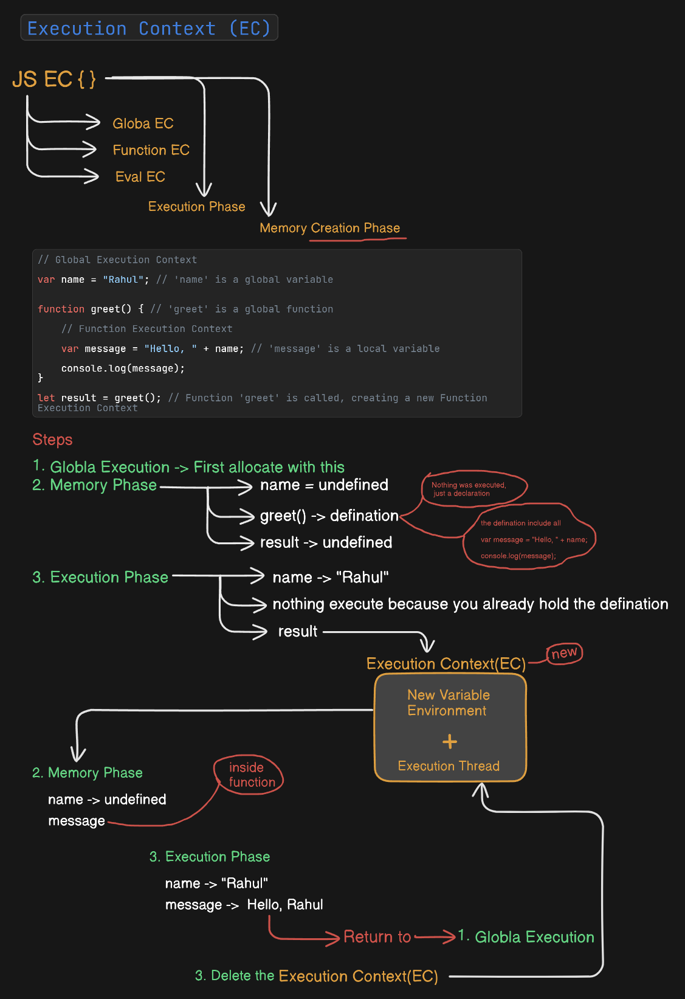
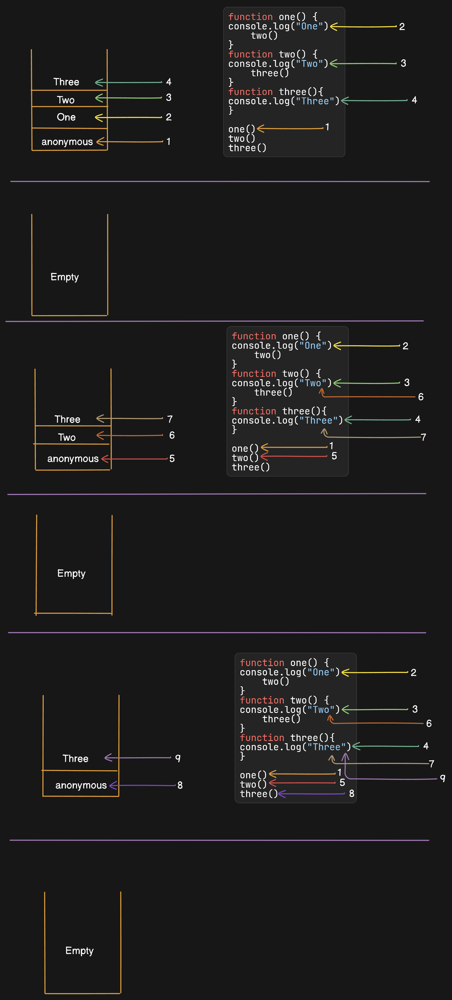
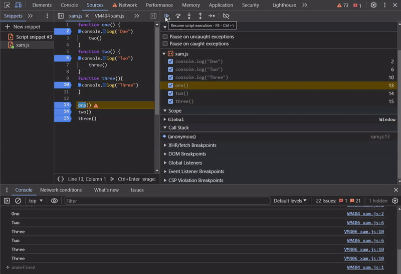

###  Exact answer for Interview

**Execution context (in simple words):**
> Execution context in JavaScript is the environment where the JavaScript code is run.This container holds all the information your JavaScript code needs to run at a specific time

**Call stack (in simple words):**
> Call stack is a data structure that keeps track of multiple execution contexts created during code execution.

### Explanation:
#### Global Execution Context

1. **Global Execution Context**:
    - Created when the JavaScript code starts running.
    - It contains global variables and functions.
2. **Function Execution Context**:
    - Created when a function is called.
    - It contains local variables, arguments, and the function's `this`.
3. **Creation Phase**:
    - Variables and functions are set up in memory.
    - Variables are `undefined` initially.
4. **Execution Phase**:
    - Code is executed line by line.
    - Variables get their values.

### Example Code:
```javascript
// Global Execution Context
var name = "Rahul"; // 'name' is a global variable

function greet() { // 'greet' is a global function
    // Function Execution Context
    var message = "Hello, " + name; // 'message' is a local variable
    console.log(message);
}

greet(); // Function 'greet' is called, creating a new Function Execution Context
```

In the example:
- When the script runs, the global execution context is created.
- Variables `name` and function `greet` are set up in memory.
- When `greet` is called, a new execution context is created for the function.
- Inside `greet`, the variable `message` is created and the `console.log` line is executed.

#### Call Stack
```js
function one() {
console.log("One")
    two()
}
function two() {
console.log("Two")
    three()
}
function three(){
console.log("Three")
}

one()
two()
three()
```





1. **Initial Call Stack**:
   - **Before Execution**:
      - `anonymous` (global context)
   - **After `one()` is called**:
      - `one` is added to the stack.
      - `anonymous` (global context)

2. **Inside `one()`**:
   - **After `console.log("One")`**:
      - `one`
      - `anonymous` (global context)
   - **When `two()` is called**:
      - `two` is added to the stack.
      - `one`
      - `anonymous` (global context)

3. **Inside `two()`**:
   - **After `console.log("Two")`**:
      - `two`
      - `one`
      - `anonymous` (global context)
   - **When `three()` is called**:
      - `three` is added to the stack.
      - `two`
      - `one`
      - `anonymous` (global context)

4. **Inside `three()`**:
   - **After `console.log("Three")`**:
      - `three`
      - `two`
      - `one`
      - `anonymous` (global context)
   - **End of `three()`**:
      - `three` is removed from the stack.
      - `two`
      - `one`
      - `anonymous` (global context)

5. **Returning from `two()`**:
   - **End of `two()`**:
      - `two` is removed from the stack.
      - `one`
      - `anonymous` (global context)

6. **Returning from `one()`**:
   - **End of `one()`**:
      - `one` is removed from the stack.
      - `anonymous` (global context)

Explanation:

- It works like a stack data structure - follows Last In First Out (LIFO) order
- When JavaScript engine starts, it creates a global execution context and pushes it to the call stack
- Whenever a function is called, a new execution context is created for that function and pushed to the call stack
- When function finishes executing, its execution context is popped off from the call stack
- Stack Overflow error occurs when call stack gets too large (maximum call stack size exceeded)

```js
let a = 10;

function add(b) {
    let result = a + b;
    return result;
}

function multiply(c) {
    let sum = add(5); // New execution context created for add()
    let product = sum * c;
    return product;
}

let output = multiply(3); // New execution context created for multiply()
console.log(output); // 45

// Call Stack:
// multiply() execution context
// add() execution context  
// Global execution context
```

- Call stack maintains proper order of execution
- Helps keep track of where currently executing code came from
- Crucial for handling async operations and event loop in JavaScript